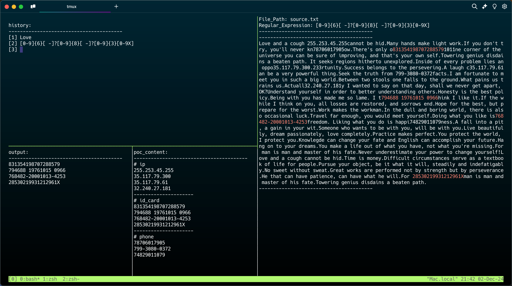

# RegView
一个实现正则可视化的脚本，帮助我们更好地学习正则。

- 需要在tmux终端下使用。
- 根据传入参数的不同有两种使用模式。
- 支持多种流派正则。

欢迎上传正则小难题，帮助大家提升正则水平

---
等待解决的问题或优化。
1. 增加对方向键的支持。
~~2. 使用perl替换sed获得更好的正则支持。~~
3. 将输入的正则表达式返回到输入缓冲区。
4. 对输入使用响应式处理替换原有的回车交互方式。
5. poc_content的内容匹配方式需要修改。

希望还有更新的一天，估计很长一段时间不会再回头看这个项目了hah
